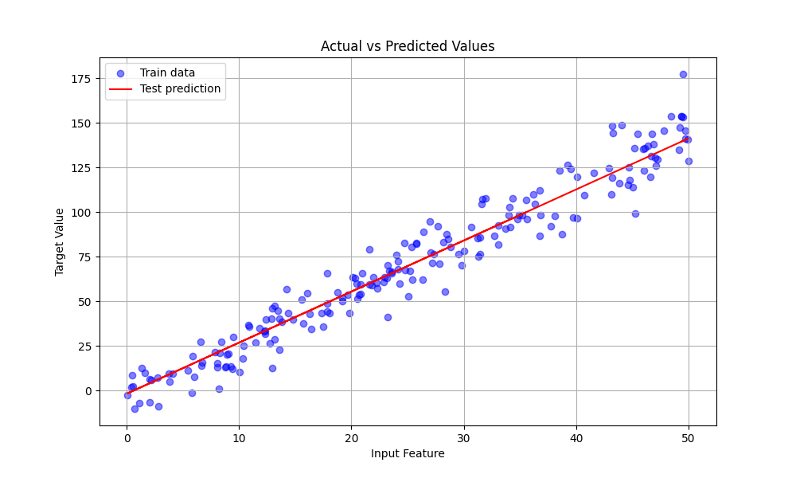

# SwarmFit

## Introduction

**SwarmFit** is a lightweight C++ library designed for regression fitting problems using Particle Swarm Optimization (PSO). It enables users to find optimal parameters for mathematical models that best approximate the relationship between predictor variables and target values in their datasets. Input data is expected in CSV format, containing columns of predictors and corresponding targets.

The core PSO algorithm iteratively explores the parameter space by simulating a swarm of candidate solutions, balancing exploration and exploitation to minimize an error metric. SwarmFit includes several built-in models and error evaluators, providing flexibility to handle a variety of regression scenarios.

Designed with extensibility in mind, SwarmFit’s modular architecture allows developers to easily integrate new models, custom error functions, or alternative optimization strategies without major modifications to the existing codebase.

This documentation will guide you through the installation process, basic usage, and customization options so you can effectively apply SwarmFit to your regression tasks.

## Minimum Requirements

To run **SwarmFit**, your system should meet the following minimum requirements:

### Hardware

- **CPU:** Dual-core processor (Intel/AMD, 2.0 GHz or higher)
- **RAM:** 4 GB (8 GB recommended)
- **Disk Space:** 50 MB for build artifacts and example datasets

### Software

- C++ Compiler: Full C++20 support (e.g., `g++ ≥ 10`, `clang++ ≥ 12`, MSVC 2019 v16.10+)
- CMake: Version 3.10 or higher
- Python 3: Version 3.6 or higher (for optional helper scripts and plotting)

## Usage

SwarmFit is used via the command line and expects a dataset in CSV format. Each row must contain the same number of numerical values: the last value in each row is interpreted as the target, and all preceding values are treated as predictors.

The application fits a regression model to the user-provided data using PSO. Once optimized, the model is used to generate predictions on the same input data. These predictions are saved in a new CSV file, preserving the original dataset structure — the same predictors are retained, but the original target values are replaced with the model’s predicted outputs. This format ensures clear alignment between each input and its corresponding prediction, allowing for seamless comparison or visualization.


### Input Format

- CSV with no headers.
- Uniform row length: N predictors followed by 1 target value.
- All values must be numeric.

### Building the Executable

To compile the application, run:

```bash
chmod +x build.sh
./build.sh
```

This script sets up a build directory, runs CMake, and compiles the project. The resulting binary will be located at `./build/SwarmFit`.

> Upon a successful build, you will see the message `Build completed successfully.` after the standard CMake configuration and compilation output.

After building the project, the executable can be run with the following syntax:

```bash
./build/SwarmFit <model_type> <input_csv_file> <output_csv_file>
```

### Arguments

| Argument            | Description                                                                 |
|---------------------|-----------------------------------------------------------------------------|
| `<model_type>`      | Type of regression model to fit. Supported options: `linear`, `sine`        |
| `<input_csv_file>`  | Path to the input CSV file with predictors and target values                |
| `<output_csv_file>` | Path to the output CSV file where predicted values will be written          |

### Configuring Optimization and Fitting Behavior

SwarmFit allows users to customize optimization and PSO dynamics by modifying parameters defined in the `const.h` header file. This centralization ensures that configuration values are easy to manage and update.

#### Fit Control Parameters

The following constants in [`const.h`](./src/const.h) control the fitting behavior:

- `Constants::MAX_STEPS`: Maximum number of optimization iterations.
- `Constants::MIN_DELTA`: Minimum required improvement between steps.
- `Constants::N_TOLERANCE`: Number of consecutive non-improving steps after which training is stopped early.

These constants determine how long training should continue and under what conditions it should be stopped due to stagnation.

#### PSO Configuration Parameters

The behavior of the optimizer is also controlled by constants in [`const.h`](./src/const.h):

- `Constants::SEED`: Random seed for reproducibility.
- `Constants::N_PARTICLES`: Number of particles in the swarm.
- `Constants::W_INERTIA`: Influence of previous velocity on current motion.
- `Constants::COGNITIVE_COEF`: Weight of the particle’s personal best influence.
- `Constants::SOCIAL_COEF`: Weight of the global best influence.

By adjusting these constants, users can fine-tune the exploration–exploitation tradeoff, swarm dynamics, and convergence sensitivity of the PSO algorithm.

#### Configuring Search Space Domains

To configure the search space domains for the PSO, modify the `DOMAIN` constant defined in the respective model's header file. This ensures that the domain bounds are centralized and easy to update. For example:

- **Sine Model**: Update the `DOMAIN` constant in `sine.h`:
  ```cpp
  private:
      static constexpr auto DOMAIN = std::pair{-30, 30}; // Modify bounds here

By changing the `DOMAIN` constant, you can control the range of values that the PSO will explore for each parameter in the model.

> Note: Most of configuration values are centralized in `const.h`, but the system is modular and can be extended to accept user-defined configs via CLI or config files.

## Helper Script

To assist users with testing and evaluation, SwarmFit includes a standalone Python script that provides two essential utilities:

1. **Synthetic Data Generation**: Quickly creates randomized regression datasets based on a known function with adjustable noise and dimensionality. Ideal for testing model behavior and evaluating fitting accuracy.
2. **Prediction Visualization**: Produces a plot comparing the model's predicted values against ground truth. This visual feedback helps assess the quality of the fit in a clear and interpretable way.

> This script is optional but highly recommended for users who want to validate the tool or benchmark its performance on artificial or real-world datasets.

> **Important:** The plotting functionality is primarily intended for datasets with a **single predictor variable**. If the dataset has multiple predictors, only the **first predictor** will be used as the X-axis in the plot for visualization purposes.


### Environment Setup

Before using the script, create a Python virtual environment and install the required dependencies:

```bash
python3 -m venv venv
source venv/bin/activate  # On Windows: venv\Scripts\activate
pip install -r helper_requirements.txt
```

The `helper_requirements.txt` file specifies the necessary packages such as `numpy`, `pandas`, and `matplotlib`.

### Script Usage

```bash
python3 helper.py --task <generate|plot> [options] --output <output_file>
```

### Tasks and Arguments

| Argument            | Description                                                                 |
|---------------------|-----------------------------------------------------------------------------|
| `--task`, `-t`       | Task to perform: `generate` (default) or `plot`                             |
| `--n_samples`        | Number of samples to generate (used in `generate` task). Default: `100`     |
| `--n_dims`           | Number of input dimensions (used in `generate` task). Default: `3`          |
| `--scale`, `-s`      | Noise scale applied to generated data (used in `generate`). Default: `5`    |
| `--actual`           | CSV file with actual data (used in `plot` task)                             |
| `--predicted`        | CSV file with predicted data (used in `plot` task)                          |
| `--output`, `-o`     | Output file path. Required for both tasks. Must end with `.csv` or `.png`   |

### Customizing the Target Function

By default, the generated data is based on a predefined mathematical transformation of the input predictors:

```python
def target_function(X: np.ndarray) -> np.ndarray:
    return (X * 3).sum(axis=1) - 5
```

You can modify this function directly in the script to generate datasets based on other relationships or model types.  
The definition is located in [`helper.py`](./src/helper.py#L26-L27), and any changes to it will affect how synthetic target values are computed.

---

### Example: Generating Synthetic Data

```bash
python3 helper.py --task generate --n_samples 200 --n_dims 2 --scale 10 --output ./data/synthetic.csv
```

This command creates a 2D dataset with 200 samples and noise, and saves it to `synthetic.csv`.

### Example: Plotting Actual vs Predicted

```bash
python3 helper.py --task plot --actual ./data/synthetic.csv --predicted ./data/predicted.csv --output ./data/plot.png
```

This command generates a plot comparing the predicted values to actual target values and saves it as `plot.png`.

> Note: The predicted CSV must retain the same format as the input data, with the final column replaced by the model's predicted values.


## Example Workflow

This section demonstrates a complete workflow using SwarmFit (assuming the source code was already cloned from the repo): from generating synthetic data, to fitting a regression model, and finally visualizing the results.

### Step 0: Build SwarmFit and Set Up Python Environment

Before starting, make sure the C++ binary and Python environment are ready:

#### Build the SwarmFit Executable

```bash
chmod +x build.sh
./build.sh
```

#### Set Up Python Virtual Environment for the Helper Script

```bash
python3 -m venv venv
source venv/bin/activate  # On Windows: venv\Scripts\activate
pip install -r helper_requirements.txt
```

---

### Step 1: Generate Synthetic Data

Generate a dataset with 200 samples, 1 predictor variable, and some noise:

```bash
mkdir -p data
python3 helper.py --task generate --n_samples 200 --n_dims 1 --scale 10 --output ./data/synthetic.csv
```

---

### Step 2: Fit a Regression Model and Generate Predictions

Use SwarmFit to fit a linear model to the generated dataset and save predictions:

```bash
./build/SwarmFit linear ./data/synthetic.csv ./data/predicted.csv
```

---

### Step 3: Visualize the Predictions

Plot the actual vs. predicted values:

```bash
python3 helper.py --task plot --actual ./data/synthetic.csv --predicted ./data/predicted.csv --output ./data/plot.png
```


#### Generated plot

