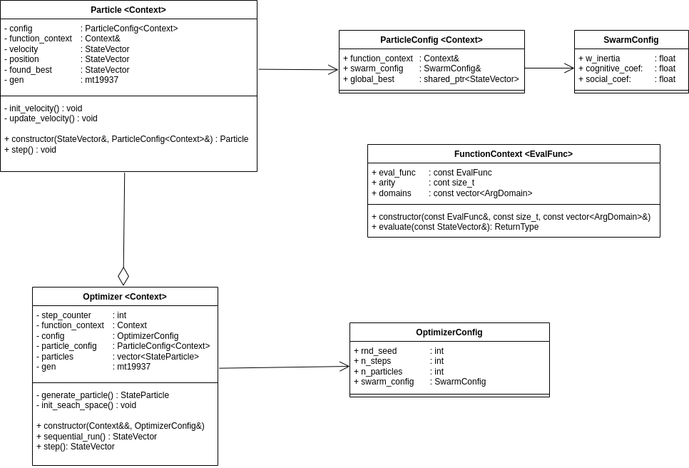

# SwarmFit

**SwarmFit** is a lightweight C++ library designed for regression fitting problems using Particle Swarm Optimization (PSO). It enables users to find optimal parameters for mathematical models that best approximate the relationship between predictor variables and target values in their datasets. Input data is expected in CSV format, containing columns of predictors and corresponding targets.

This documentation is intended for developers who wish to understand, extend, or integrate SwarmFit into their own projects. It covers the core architecture, module responsibilities, parallelization strategies, and guidelines for contributing or customizing the library.

## Getting Started with SwarmFit

To start using **SwarmFit**, follow these steps:

1. **Build the Application**:  
   Compile the application using the provided `build.sh` script. Ensure you have the required software dependencies installed (C++20 compiler, CMake, etc.).  
   ```bash
   chmod +x build.sh
   ./build.sh
   ```
   After a successful build, the executable will be located at `./build/SwarmFit`.

2. **Run the Application**:  
   Execute the application with the following syntax:  
   ```bash
   ./build/SwarmFit <model_type> <input_csv_file> <output_csv_file>
   ```
   Replace `<model_type>`, `<input_csv_file>`, and `<output_csv_file>` with appropriate values. For detailed instructions on usage, refer to the User Documentation.

3. **Debug Mode Setup**:  
   If you encounter issues or need detailed logs for debugging, enable debug mode by modifying the `DEBUG_MODE` flag in `config.h`:  
   ```cpp
   namespace GlobalConfig {
       inline constexpr bool DEBUG_MODE = true;
   }
   ```
    When debug mode is enabled, the application will output detailed information during execution, including:
    - Each particle's state at every iteration.
    - The (current / local / global best) error value computed for each particle.
    - Updates to the global best position and error value.

   Rebuild the application after enabling debug mode to apply the changes.

> For a comprehensive guide on installation, input format, and usage, refer to the [`User Documentation`](user_doc.md).

## Project Structure

SwarmFit is organized into several key modules to promote clarity, modularity, and ease of extension. The main components are:

- `main.cpp`: Entry point for running the fitting process.
- `csv_handler.*`: Utilities for reading and writing CSV data.
- `fit_runner.*`: Orchestrates the fitting workflow, including model selection and evaluation.
- `types.h`: Common type definitions used throughout the project.
- **models/**: Contains model definitions (e.g., linear, sine) and a base class for extensibility.
- **evaluators/**: Implements evaluation metrics (e.g., mean squared error) and base evaluator interfaces.
- **pso/**: Implements the Particle Swarm Optimization algorithm and related utilities.
- **utils/**: General-purpose utilities, including parallelization helpers.

- **CMakeLists.txt & build.sh**  
  Build configuration and helper scripts for compiling the project.

This modular structure makes it easy to add new models, evaluation metrics, or optimization strategies, and to integrate SwarmFit into larger projects.

## Modules Overview

SwarmFit's functionality is distributed across several core modules, each with specific responsibilities. This section provides detailed documentation for each module, including class definitions, responsibilities, and usage examples. Understanding these modules is essential for developers who want to extend or modify the library's functionality.


### Module: FitRunner

The `FitRunner` class is responsible for orchestrating the regression fitting workflow. It acts as the main interface between the model, evaluator, and the PSO optimizer, encapsulating the process of parameter optimization.

#### Class Responsibilities

- **Dependency Injection:** Accepts a model, evaluator, and dataset at construction, promoting loose coupling and testability.
- **Optimization Orchestration:** Sets up and manages the PSO optimizer, including configuration and convergence criteria.
- **Result Reporting:** Handles the output of fitting results and progress reporting.

#### API Description

##### Constructor 

```cpp
FitRunner(Model model, Evaluator evaluator, const Dataset& data)
```
- **Responsibility:** Initializes the runner with a specific model, evaluator, and dataset.
- **Input:**
    - `model`: Shared pointer to a model instance (must inherit from `BaseModel`)
    - `evaluator`: Shared pointer to an evaluator instance (must inherit from `BaseEvaluator`)
    - `data`: Reference to the dataset to be fitted
- **Throws:** None

##### Public Methods


```cpp
ParamsArray fit(double min_delta, int n_tolerance, int max_steps)
```
- **Responsibility:** Runs the PSO optimization loop to fit the model parameters to the data.
- **Input:**
    - `min_delta`: Minimum improvement in loss required to reset stagnation counter
    - `n_tolerance`: Number of steps with insufficient improvement before early stopping
    - `max_steps`: Maximum number of optimization steps
- **Output:** Returns a `ParamsArray` containing the optimized model parameters
- **Throws:** `std::runtime_error` if the evaluator or model is not initialized

##### Example Usage:
```cpp
auto runner = FitRunner(model, evaluator, data);
auto params = runner.fit(1e-5, 10, 1000);
// params now contains the best-fit parameters for the model
```

#### Design Patterns

- **Strategy Pattern:** The use of abstract base classes for models and evaluators allows for easy extension and swapping of different model types or evaluation metrics.
- **Dependency Injection:** By accepting dependencies via the constructor, `FitRunner` is decoupled from specific implementations, improving maintainability and testability.

#### Extensibility

To add new models or evaluators, simply implement the respective base class interface and pass an instance to `FitRunner`. The optimization logic remains unchanged, ensuring a clear separation of concerns.

### Module: CSVHandler

The `CSVHandler` class provides static utility functions for reading and writing CSV files, which are used for loading datasets and saving prediction results. It ensures robust parsing and serialization of data, handling common errors and enforcing consistent file formats.

#### Class Responsibilities

- **Data Loading:** Reads datasets from CSV files, parsing predictor and target values into the internal data structures.
- **Data Saving:** Writes prediction results to CSV files, pairing predictors with their corresponding predicted values.
- **Error Handling:** Validates file formats and handles I/O errors, throwing descriptive exceptions when issues are encountered.

#### API Description

##### Public Methods

```cpp
static AppTypes::Dataset load_data(const std::string& file_path)
```

- **Responsibility:** Loads a dataset from a CSV file, parsing each row into predictors and target values.
- **Input:**
    - `file_path`: Path to the input CSV file.
- **Output:** Returns a `Dataset` object containing all parsed data points.
- **Throws:** `std::runtime_error` if the file cannot be opened, a line cannot be parsed, or the format is invalid.
---
```cpp
static void save_predictions(
    const std::string& file_path,
    const std::vector<AppTypes::PredictorSet>& predictors,
    const std::vector<double>& predictions
)
```
- **Responsibility:** Saves prediction results to a CSV file, writing each predictor set and its corresponding prediction as a row.
- **Input:**
    - `file_path`: Path to the output CSV file.
    - `predictors`: Vector of predictor sets.
    - `predictions`: Vector of predicted values.
- **Output:** None.
- **Throws:** 
    - `std::invalid_argument` if the predictors and predictions vectors differ in size
    - `std::runtime_error` if the file cannot be opened or written.

*Example usage:*
```cpp
// Loading data
auto data = CSVHandler::load_data("input.csv");

// Saving predictions
CSVHandler::save_predictions("output.csv", predictors, predictions);
```

### Module: Models

The `models` module defines the mathematical models used for regression fitting. All models inherit from a common abstract base class, enabling polymorphic usage and easy extensibility. This design allows new models to be added with minimal changes to the rest of the codebase.

#### Class Hierarchy

- **BaseModel** (abstract)
    - **LinearModel**
    - **SineModel**

#### Class Responsibilities

- **BaseModel:**  
  Serves as the abstract interface for all regression models. It defines the required API for prediction, parameter domain specification, and model identification. It also provides utility methods for input validation and bias augmentation.

- **LinearModel:**  
  Implements a standard linear regression model. It predicts outputs as a linear combination of input predictors and a bias term.

- **SineModel:**  
  Implements a model where the output is a sum of sine functions of the predictors, allowing for the fitting of periodic or oscillatory data.

#### API Description

```cpp
double predict(const PredictorSet& X, const ParamsArray& theta) const
```
- **Input:**
    - `X`: Predictor set (features) for a single data point.
    - `theta`: Model parameter vector.
- **Output:** Returns the predicted value as a double.
- **Throws:**
    - May throw `std::invalid_argument` if input dimensions are invalid (implementation-dependent).

```cpp
std::string get_slug() const
```
- **Input:** None.
- **Output:** Returns a string identifier for the model (e.g., "linear model", "sine model").
- **Throws:** None.

```cpp
const ParamDomains& get_param_domains() const
```
- **Input:** None.
- **Output:** Returns a reference to the parameter domains (vector of allowed parameter ranges for optimization).
- **Throws:** None.

```cpp
size_t get_model_dims() const
```
- **Input:** None.
- **Output:** Returns the expected dimensionality of the input data (number of predictors).
- **Throws:** None.

```cpp
void validate_dims(const ParamsArray& target, size_t expected_dim) const
```
- **Input:**
    - `target`: Parameter or predictor vector to validate.
    - `expected_dim`: Expected dimensionality.
- **Output:** None.
- **Throws:**
    - `std::invalid_argument` if the size of target does not match expected_dim.
- **Note:** Used internally to enforce correct input sizes.

```cpp
static ParamsArray append_bias(const PredictorSet& predictors)
```
- **Input:**
    - `predictors`: Predictor set (features) for a single data point.
- **Output:** Returns a new parameter array with an additional bias term appended.
- **Throws:** None.
- **Note:** Utility method for models that use a bias term

---

##### Example usage:
```cpp
// Create a linear model for 3 predictors
auto model = std::make_shared<LinearModel>(3);
auto y_pred = model->predict(predictors, params);

// Create a sine model for 2 predictors
auto sine_model = std::make_shared<SineModel>(2);
auto y_sine = sine_model->predict(predictors, params);
```

#### Design Patterns
- **Abstract Base Class (Interface):** `BaseModel` defines the interface for all models, enforcing a consistent API.
- **Polymorphism:** The use of virtual methods allows the optimizer and runner to work with any model derived from `BaseModel` without modification.
- **Single Responsibility Principle:** Each model class encapsulates the logic for a specific mathematical form.
#### Extensibility
To add a new model:
1) Inherit from `BaseModel`.
2) Implement the required methods (`predict`, `get_slug`, and constructor).
3) Register or instantiate the new model in the fitting workflow as needed.

This approach ensures that new models can be integrated with minimal changes to the rest of the codebase.

### Module: Evaluators

The `evaluators` module defines the evaluation metrics used to assess model performance during optimization. All evaluators inherit from a common abstract base class, enabling polymorphic usage and easy extensibility. This design allows new evaluation strategies to be added with minimal changes to the rest of the codebase.

#### Class Hierarchy

- **BaseEvaluator** (abstract)
    - **MSEEvaluator**

#### Class Responsibilities

- **BaseEvaluator:**  
  Serves as the abstract interface for all evaluators. It defines the required API for evaluating a model's performance on a dataset given a set of parameters. It holds a reference to the model being evaluated.

- **MSEEvaluator:**  
  Implements the mean squared error (MSE) metric, which measures the average squared difference between predicted and target values.

#### API Description

```cpp
double evaluate(const DataSet& data, const ModelParams& theta) const
```
- **Input:**
    - `data`: Dataset containing predictors and target values.
    - `theta`: Model parameters to evaluate.
- **Output:** Returns the evaluation score as a double (e.g., MSE).
- **Throws:**
    - `std::invalid_argument` if the model parameters do not match the expected dimensions of the model.
---
##### Example usage:
```cpp
auto evaluator = std::make_shared<MSEEvaluator>(model);
double mse = evaluator->evaluate(data, params);
```

#### Design Patterns
- **Abstract Base Class (Interface):** `BaseEvaluator` defines the interface for all evaluators, enforcing a consistent API.
- **Polymorphism:** The use of virtual methods allows the optimizer and runner to work with any evaluator derived from `BaseEvaluator` without modification.
- **Single Responsibility Principle:** Each evaluator class encapsulates the logic for a specific evaluation metric.

#### Extensibility
To add a new evaluator:
1) Inherit from `BaseEvaluator`.
2) Implement the required methods (`evaluate` and constructor).
3) Register or instantiate the new evaluator in the fitting workflow as needed.

This approach ensures that new evaluation metrics can be integrated with minimal changes to the rest of the codebase.

### Module: Utils

The `utils` module provides general-purpose utility functions and classes that support various aspects of the library, such as parallelization, random number generation, and data manipulation. These utilities are designed to be reusable and modular, ensuring clean and efficient code.

#### API Description

```cpp
template <typename T, size_t N_ARGS>
void compute_on_dims(
    const std::array<std::vector<T>, N_ARGS>& arg_arrays,
    std::vector<T>& result,
    const size_t start_dim,
    const size_t end_dim,
    const std::function<T(std::array<T, N_ARGS>&)> op
)
```
- **Responsibility:** Performs computations on specific dimensions of input arrays.
- **Input:**
    - `arg_arrays`: Array of vectors containing input arguments for the operation.
    - `result`: Vector to store the results of the computation.
    - `start_dim`: Starting dimension index for computation.
    - `end_dim`: Ending dimension index for computation.
    - `op`: Function to apply to each set of arguments.
- **Output:** None (results are stored in the `result` vector).
- **Throws:** None.


---
```cpp
template <typename T, size_t N_ARGS>
std::vector<T> parallelize(
    const std::array<std::vector<T>, N_ARGS>& args,
    const std::function<T(const std::array<T, N_ARGS>&)>& op,
    const size_t dim
)
```
- **Responsibility:** Executes a function `op` in parallel across multiple threads, distributing the input arguments across the specified dimension.
- **Input:**
    - `args`: Array of vectors containing input arguments for the operation.
    - `op`: Function to apply to each set of arguments.
    - `dim`: Number of dimensions to process.
- **Output:** Returns a vector of results from applying `op` to each set of arguments.
- **Throws:**
    - `std::invalid_argument` if input dimensions are inconsistent.
---

```cpp
template<typename ArgType>
ArgType random_value(ArgType min, ArgType max, std::mt19937& gen)
```
- **Responsibility:** Generates a random value within the specified range using a provided random number generator.
- **Input:**
    - `min`: Minimum value of the range.
    - `max`: Maximum value of the range.
    - `gen`: Reference to a random number generator (e.g., `std::mt19937`).
- **Output:** Returns a random value of type `ArgType` within the specified range.
- **Throws:** None.
---
```cpp
inline AppTypes::DataPoint make_data_point(const std::vector<double>& values)
```
- **Responsibility:** Creates a `DataPoint` from a vector of values, ensuring the correct format for internal data structures.
- **Input:**
    - `values`: Vector of double values representing predictors and target.
- **Output:** Returns a `DataPoint` object containing the provided values.
- **Throws:** None
---
```cpp
template<typename ArgType>
void print_vector(const std::vector<ArgType>& vector)
```
- **Responsibility:** Prints the contents of a vector to the standard output, formatted for readability.
- **Input:**
    - `vector`: Vector of values to print.
- **Output:** None (prints to standard output).
- **Throws:** None.

#### Example usage:
```cpp
// Parallelization example
std::array<std::vector<double>, 2> inputs = {{...}, {...}};
std::vector<double> results(inputs[0].size());
compute_on_dims(inputs, results, 0, inputs[0].size(), [](auto args) {
    return args[0] + args[1];
});

// Random value example
std::mt19937 gen(std::random_device{}());
double random_val = random_value(0.0, 1.0, gen);

// Data utilities example
std::vector<double> values = {1.0, 2.0, 3.0};
auto data_point = make_data_point(values);
print_vector(values);
```

## PSO Module Overview
The `pso` module implements the Particle Swarm Optimization (PSO) algorithm, which is used to optimize model parameters based on the evaluation metrics defined in the evaluators module. This module encapsulates the PSO logic, including particle initialization, movement, and convergence criteria.



### Class: FunctionContext

The `FunctionContext` class provides a flexible interface for evaluating functions during optimization. It encapsulates the function to be evaluated, its argument domains, and its arity (number of arguments). This class is essential for ensuring that the optimization process respects the constraints and dimensionality of the target function.

#### Class Responsibilities

- **Function Encapsulation:**  
  Stores the function to be evaluated and provides an interface for invoking it with a state vector.
- **Dimensionality Enforcement:**  
  Ensures that the input state vector matches the expected number of arguments (arity).
- **Domain Constraints:**  
  Defines the valid ranges for each argument, ensuring that the optimization process respects these constraints.

#### API Description

```cpp
FunctionContext(const EvalFunc& func, const size_t arity, const std::vector<ArgDomain>& func_domains)
```
- **Responsibility:** Initializes the function context with the target function, its arity, and argument domains.
- **Input:**
    - `func`: Function to be evaluated (signature: `double(const std::vector<double>&)`).
    - `arity`: Number of arguments the function expects.
    - `func_domains`: Vector of argument domains, defining valid ranges for each argument.
- **Throws:** None.
---

```cpp
ReturnType evaluate(const StateVector& state_vector) const
```
- **Responsibility:** Evaluates the function with the provided state vector, ensuring it matches the expected arity.
- **Input:**
    - `state_vector`: Vector of arguments to pass to the function.
- **Output:** Returns the result of the function evaluation as a `ReturnType` (type parameter of the class).
- **Throws:**
    - `std::invalid_argument` if the size of `state_vector` does not match the expected arity.

#### Example Usage:
```cpp
auto func = [](const std::vector<double>& args) -> double {
    return args[0] * args[1] + args[2];
};

std::vector<std::pair<double, double>> domains = {{0.0, 1.0}, {0.0, 1.0}, {0.0, 1.0}};
FunctionContext<decltype(func)> context(func, 3, domains);

std::vector<double> state_vector = {0.5, 0.5, 0.5};
double result = context.evaluate(state_vector);
```

#### Design Patterns
- **Encapsulation:** The `FunctionContext` class encapsulates the function and its constraints, providing a clean interface for evaluation.
- **Single Responsibility Principle:** The class is focused solely on managing the function's evaluation and constraints, ensuring modularity.

### Class: Particle

The `Particle` class represents an individual particle in the PSO algorithm. Each particle explores the search space, updating its position and velocity based on its own experience and the experience of other particles in the swarm. This class encapsulates the logic for particle movement, velocity updates, and optimization steps.

#### API Description

```cpp
Particle(
    const StateVector& init_position,
    const ParticleConfig<Context>& configuration
)
```
- **Responsibility:** Initializes a particle with a starting position and configuration parameters.
- **Input:**
    - `init_position`: Initial position of the particle in the search space.
    - `configuration`: Configuration parameters for the particle, including cognitive and social coefficients.
- **Throws:**
    - `std::invalid_argument` if the initial position does not match the expected dimensions.

---
```cpp
void step()
```
- **Responsibility:** Performs a single optimization step, updating the particle's position, velocity, and best-known positions.

### Class: Optimizer

The `Optimizer` class implements the PSO algorithm, managing the swarm of particles and orchestrating the optimization process. It encapsulates the logic for particle initialization, movement, and convergence, ensuring efficient exploration of the search space.

#### Class Responsibilities

- **Swarm Initialization:**  
  Generates particles in the search space, sampling their initial positions uniformly within the defined domains.
- **Optimization Steps:**  
  Advances the state of each particle, updating their positions and velocities based on swarm dynamics.
- **Global Best Tracking:**  
  Maintains and updates the best-known solution across all particles in the swarm.

#### API Description

```cpp
Optimizer(const Context&& context, const OptimizerConfig& configuration)
```
- **Responsibility:** Initializes the optimizer with a function context and configuration parameters.
- **Input:**
    - `context`: Function context encapsulating the target function and its constraints.
    - `configuration`: Configuration parameters for the optimizer, including swarm parameters and domain constraints.
---

```cpp
StateVector step()
```
- **Responsibility:** Performs a single optimization step for all particles, updating their positions and velocities.
- **Input:** None.
- **Output:** Returns the current global best solution.
---

```cpp
StateVector sequential_run()
```
- **Responsibility:** Executes the PSO optimization procedure sequentially for the configured number of steps.
- **Input:** None.
- **Output:** Returns the global best solution after completing all optimization steps.

#### Example Usage:
```cpp
SwarmConfig swarm_conf = {0.2, 0.6, 0.8};
OptimizerConfig opt_conf = {42, 1000, 50, swarm_conf};

auto func = [](const std::vector<double>& args) -> double {
    return args[0] * args[1] + args[2];
};

std::vector<std::pair<double, double>> domains = {{0.0, 1.0}, {0.0, 1.0}, {0.0, 1.0}};
FunctionContext<decltype(func)> context(func, 3, domains);

Optimizer<decltype(context)> optimizer(std::move(context), opt_conf);
auto best_solution = optimizer.sequential_run();
```

#### Design Patterns
- **Encapsulation:** The `Optimizer` class encapsulates the PSO logic, ensuring modularity and clarity.
- **Single Responsibility Principle:** The class focuses solely on managing the swarm and orchestrating the optimization process.
- **Factory Method:** The `generate_particle` method creates particles in the search space, ensuring uniform sampling within the defined domains.
